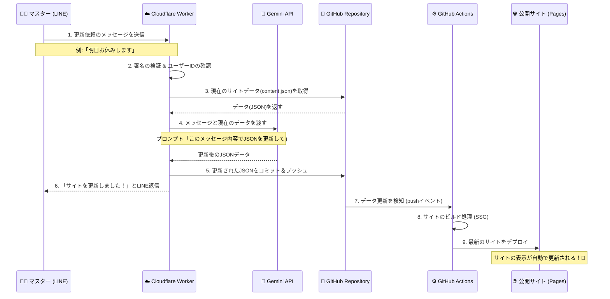

# 🍷 いなかくらぶWEBマネージャ アーキテクチャ

このドキュメントでは、スナック「いなかくらぶ」のウェブサイトをLINEから更新するためのシステム構成とデータの流れについてまとめています。

## 🏗️ 全体構成図 (データフロー)

## 💡 各サービスの役割

| サービス | 役割 | 備考 |
| :--- | :--- | :--- |
| **LINE Messaging API** | マスター用インターフェース | ユーザーIDによるアクセス制限を実施 |
| **Cloudflare Workers** | システムの司令塔 (Webhook処理) | LINE署名検証、GitHub/Gemini API連携 |
| **Gemini API** | 自然言語解析・データ変換 | 曖昧な日本語を正確なJSONデータに変換 |
| **GitHub** | データベース ＆ ソース管理 | `content.json` が実質的なDBとして機能 |
| **GitHub Actions** | 自動ビルド・デプロイ | pushを検知してサイトを自動更新 |
| **Cloudflare Pages** | 静的サイトホスティング | 高速・安全・無料枠で運用 |

## 🛡️ セキュリティ設定

### 1. LINE署名検証 (`x-line-signature`)
Cloudflare Worker側で、LINE公式サーバーからの通信であるかを常に検証しています。

### 2. ユーザーID制限 (`ALLOWED_LINE_USER_IDS`)
特定のLINEユーザーID（マスターとGabin）からのメッセージのみを受け付けるようにロックをかけています。

## 🚀 今後の拡張案
- **画像連携**: SNS（Instagram/X）へのリンクまたは埋め込みウィジェットの活用。
- **音声入力**: LINEのボイスメッセージをテキスト化して更新（Geminiで対応可能）。
- **複数店舗展開**: 同様の仕組みを他の店舗にも横展開可能な設計。

---
Created by Gabin & An-chan (2026-05-01)
